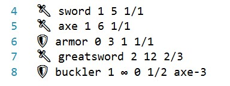

# CsharpDemo_Duels



Simple class library describing duels between warriors.   
Has an external library of weapons and armors, weapons and warriors can have modificators and special abilities.

```csharp
Warrior fighter = new Swordsman("Veteran")
                          .Equip("swordweak")
                          .Equip("armorweak");

Warrior demon = new Demon("Vicious")
                          .Equip("sword")
                          .Equip("grandsword")
                          .Equip("axe")
                          .Equip("grandaxe")
                          .Equip("spear")
                          .Equip("grandspear");

var poison = new DamageModifier(0, 20);
demon.AddModifier(poison);

var hope = new DamageModifier(100, 1, "∞");
fighter.SetModifierTotal(hope);

fighter.Engage(demon);
Console.WriteLine(fighter.HitPoints());
```

Test made for [Virtual Regatta](http://virtualregatta.com)